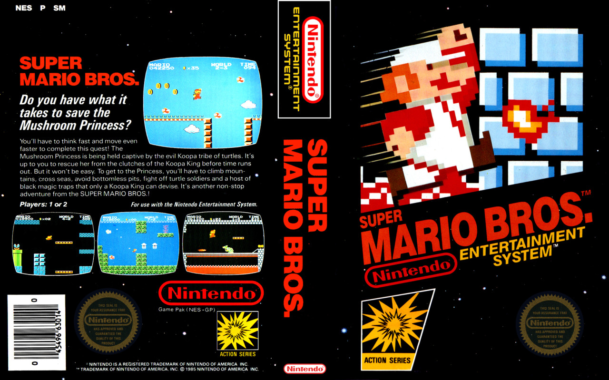
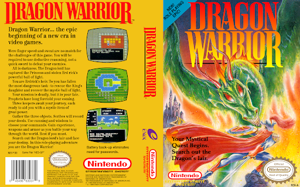

# Formal Genre Markers

In this file I'm specifically looking for *formal genre markers*, which is not the same as merely mentioning the genre term in marketing copy or in review text.

A *formal genre marker* is part of an overriding classification scheme rather than a one-off description of a particular item. My criteria:

- The markers are used consistently over a series of titles in a defined collection over a defined period of time
- The markers correspond to what we now would recognize as genre terms, even if they're not explicitly labeled as genre (I've seen "category", "theme", etc used instead of "genre" and this is okay)
- The markers can be simply words, or also iconography, so long as they're consistent
- The size and duration of the defined collection doesn't really matter -- one issue of one magazine is sufficient as long as there's an obvious classification scheme

Example of formal genre marker:

The "Action" emblem is used consistently across multiple different titles, along with a set of different icons for other genres.

NOT examples of formal genre markers:

Dragon Warrior is described as a "Role-Playing epic" which is indeed a genre term, but this box art was a) designed by Enix and not Nintendo, and b) the term is just incidental marketing copy rather than part of an official genre classification scheme. If Enix had produced a variety of titles for the NES and consistently applied their own genre classification system, this *would* count as a formal genre marker.
